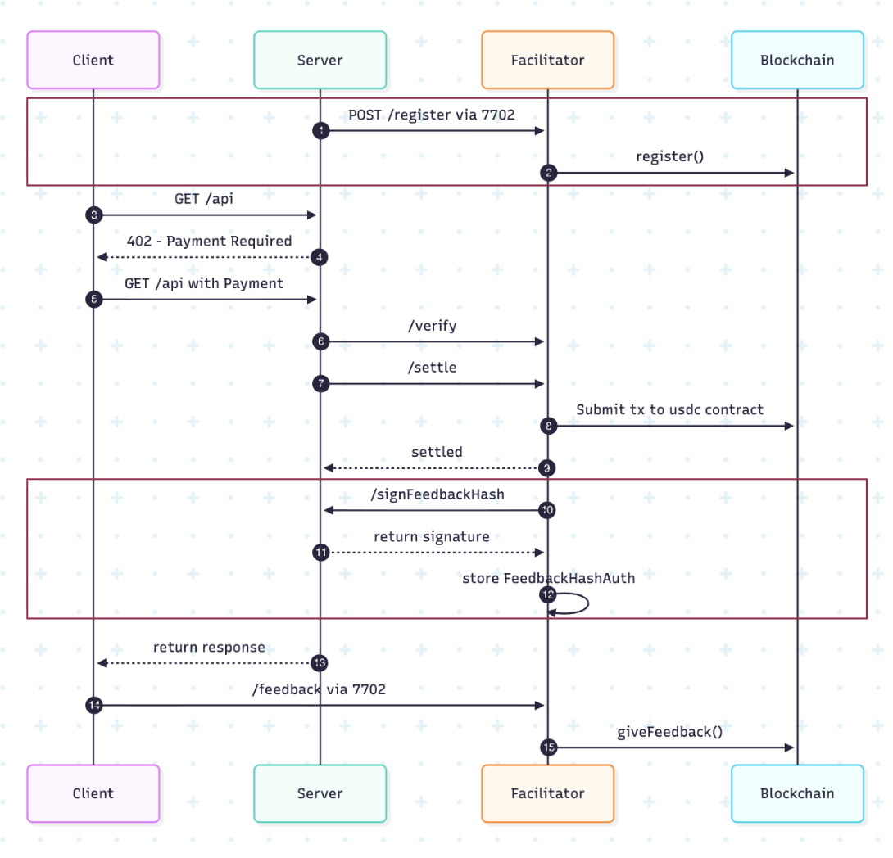

# x402 8004 Facilitator

A facilitator acts as the service access point for x402 payments: verifying user requests, settling payments on-chain. This implementation extends that flow with ERC-8004 identity and feedback primitives, enabling fully onchain agent registration and authenticated service evaluation.

**Networks**: Base Sepolia + Base Mainnet  
**Facilitator URL**: set per deployment (local default: `http://localhost:4022`)  
**Delegation Contract**: `0xFdc90fCC6929a2f42a9D714bD10520eEE98bD378`

## Features

- **Payment Processing**: Verify and settle payments for both x402 v1 and v2
- **ERC-8004 Integration**: Agent registration via EIP-7702 delegation
- **Feedback System**: Enables agent signing feedback auth within the x402 payment flow

## Quick Start

### Prerequisites

- Node.js 18+
- Environment variables configured (see `.env`)

### Installation

```bash
bun install
```

### Configuration

Create a `.env` file with the following variables:

```env
# Required
FACILITATOR_PRIVATE_KEY=0x...

# RPC config (choose ONE):
# 1) Single RPC for all supported networks
RPC_URL=https://sepolia.base.org
# 2) Per-network RPC mapping (recommended for multi-network)
RPC_URLS_JSON={"eip155:84532":"https://sepolia.base.org","eip155:8453":"https://mainnet.base.org"}

ERC8004_IDENTITY_REGISTRY_ADDRESS=0x...
DELEGATE_CONTRACT_ADDRESS=0xFdc90fCC6929a2f42a9D714bD10520eEE98bD378

# Optional discovery crawler
DISCOVERY_ENABLED=false
DISCOVERY_SEEDS=https://api.example.com/my-x402-endpoint
DISCOVERY_INTERVAL_SECONDS=300
DISCOVERY_MAX_DEPTH=2
DISCOVERY_MAX_REQUESTS=50
DISCOVERY_TIMEOUT_MS=10000
# DISCOVERY_CATALOG_PATH=./data/discovery-catalog.json
```

**Note**: The delegation contract address above is for Base Sepolia. Configure contract addresses via env vars for your target network(s).

### Run

```bash
bun run dev
```

## API Endpoints

- `POST /verify` - Verify a payment
- `POST /settle` - Settle a payment on-chain
- `POST /register` - Register an agent with ERC-8004 (EIP-7702)
- `GET /supported` - Get supported payment schemes
- `POST /discover` - Crawl discovery-enabled resources and store `PaymentRequired` responses (v2)
- `GET /catalog` - Read the discovery catalog snapshot
- (Release soon after 8004 upgrades) `POST /feedback` - Allow clients to submit feedback for 8004 agents via the facilitator

## /supported (v2 shape)

`GET /supported` returns a v2 response shape:

- `kinds`: grouped by x402 version (`"1"`, `"2"`)
- `signers`: CAIP family pattern → signer address list (e.g. `"eip155:*"`)
- `extensions`: facilitator-implemented extensions (e.g. `discovery`, `feedback`)

## Example Server Integrations

This repository includes example server implementations demonstrating how to integrate with the facilitator:

- **`examples/v1-server/`** - Example server using x402 v1 specification with legacy `x402-express` middleware
- **`examples/v2-server/`** - Example server using x402 v2 specification with `@x402/core` and `@x402/express`
  - **Note**: Requires x402 v2-development branch

Both examples include:

- Payment-protected resource endpoints
- Agent registration via EIP-7702
- Feedback authorization signing endpoints

See the `examples/` directory for complete working implementations.

## Flow Diagram


